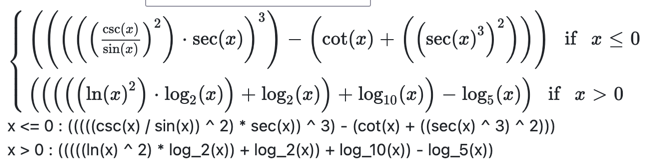
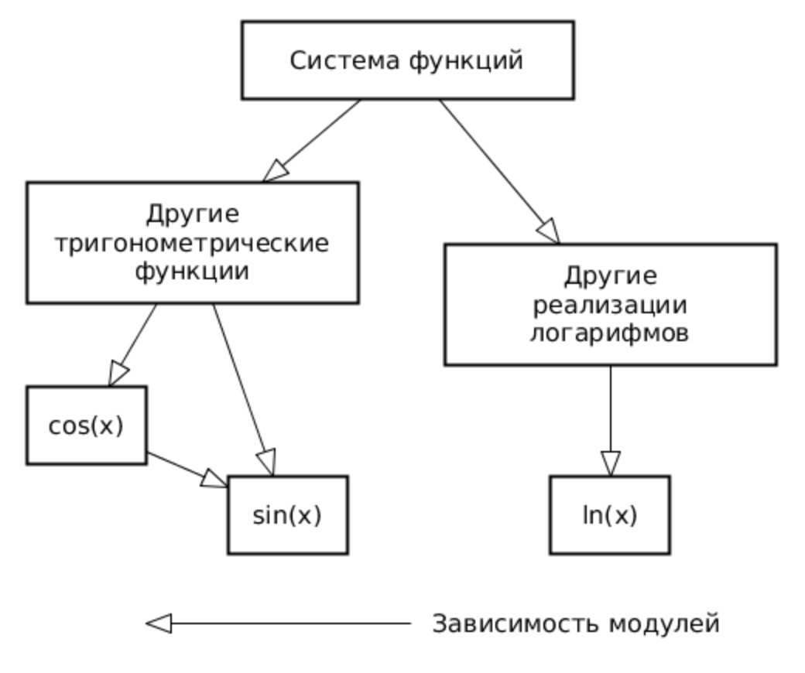
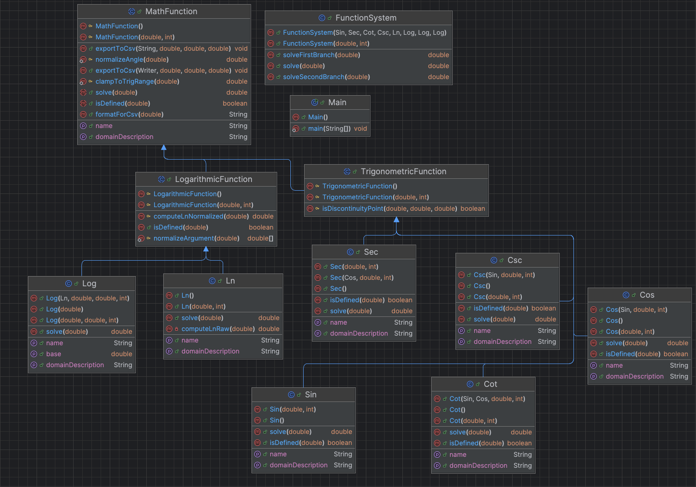
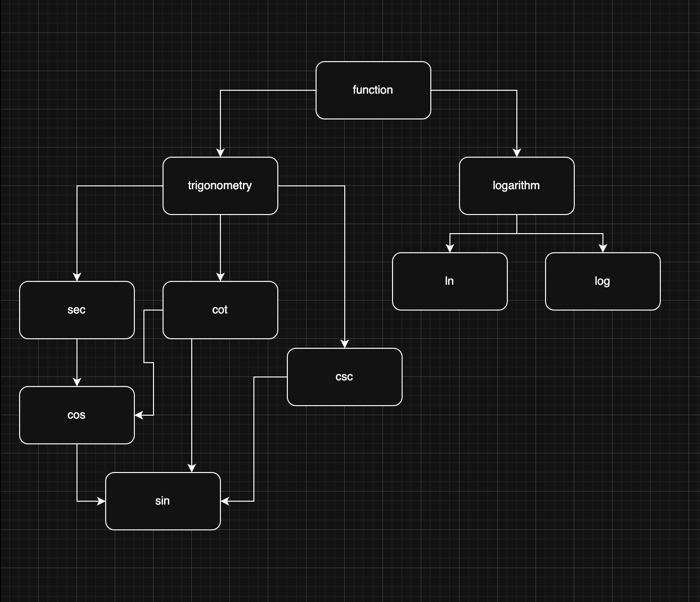

# Лабораторная работа #2

### Провести интеграционное тестирование программы, осуществляющей вычисление системы функций (в соответствии с вариантом).
### Вариант 9506



### ***Правила выполнения работы***

    1. Все составляющие систему функции (как тригонометрические, так и логарифмические) должны быть выражены через базовые (тригонометрическая зависит от варианта; логарифмическая - натуральный логарифм).

    2. Структура приложения, тестируемого в рамках лабораторной работы, должна выглядеть следующим образом (пример приведён для базовой тригонометрической функции sin(x)):



    3. Обе "базовые" функции (в примере выше - sin(x) и ln(x)) должны быть реализованы при помощи разложения в ряд с задаваемой погрешностью. Использовать тригонометрические / логарифмические преобразования для упрощения функций ЗАПРЕЩЕНО.

    4. Для КАЖДОГО модуля должны быть реализованы табличные заглушки. При этом, необходимо найти область допустимых значений функций, и, при необходимости, определить взаимозависимые точки в модулях.

    5. Разработанное приложение должно позволять выводить значения, выдаваемое любым модулем системы, в сsv файл вида «X, Результаты модуля (X)», позволяющее произвольно менять шаг наращивания Х. Разделитель в файле csv можно использовать произвольный.

### ***Порядок выполнения работы***

    1. Разработать приложение, руководствуясь приведёнными выше правилами.
    2. С помощью JUNIT5 разработать тестовое покрытие системы функций, проведя анализ эквивалентности и учитывая особенности системы функций. Для анализа особенностей системы функций и составляющих ее частей можно использовать сайт https://www.wolframalpha.com/.
    3. Собрать приложение, состоящее из заглушек. Провести интеграцию приложения по 1 модулю, с обоснованием стратегии интеграции, проведением интеграционных тестов и контролем тестового покрытия системы функций.


### ***UML диаграмма классов***



### ***Описание тестового покрытия***



### ***ОДЗ для всех функций***

## Базовые функции

***1. sin(x) - синус***

| Параметр | Значение | 
| :---: | :---: |
| ОДЗ | x ∈ ℝ |
| Точки разрыва | Отсутствуют (непрерывная функция) |
| Период | 2π |
| Возвращает NaN | Только при x = NaN или x = ±Infinity |

```java
    isDefined(x) = true; // для всех конечных x
```

***2. ln(x) - натуральный логарифм***

| Параметр | Значение | 
| :---: | :---: |
| ОДЗ | x ∈ (0, +∞) (строго положительные числа)|
| Точки разрыва | x = 0 (вертикальная асимптота), x < 0 (не определён) |
| Период | - |
| Возвращает NaN | При x ≤ 0, x = NaN, x = ±Infinity |

```java
    isDefined(x) = (x > 0) && (x != Infinity);
```

## Производные тригонометрические функции

***3. cos(x) - косинус***

| Параметр | Значение | 
| :---: | :---: |
| ОДЗ | x ∈ ℝ |
| Точки разрыва | Отсутствуют (непрерывная функция) |
| Период | 2π |
| Возвращает NaN | Только при x = NaN или x = ±Infinity |

```java
    isDefined(x) = true; // для всех конечных x
```

***4. Sec(x) - секанс [1/cos(x)]***

| Параметр | Значение | 
| :---: | :---: |
| ОДЗ | x ∈ ℝ, x ≠ π/2 + πk, k ∈ ℤ |
| Точки разрыва | x = π/2 + πk (где cos(x) = 0) |
| Период | 2π |
| Возвращает NaN | В точках разрыва, при x = NaN, при x = ±Infinity |


***примеры точек разрыва:***
```
..., -5π/2, -3π/2, -π/2, π/2, 3π/2, 5π/2, ...
```

```java
    isDefined(x) = !isDiscontinuityPoint(x, π, π/2);
```

***5. Csc(x) - косеканс [1/sin(x)]***

| Параметр | Значение | 
| :---: | :---: |
| ОДЗ | x ∈ ℝ, x ≠ πk, k ∈ ℤ |
| Точки разрыва | x = πk (где sin(x) = 0) |
| Период | 2π |
| Возвращает NaN | В точках разрыва, при x = NaN, при x = ±Infinity |

***примеры точек разрыва:***
```
..., -2π, -π, 0, π, 2π, 3π, ...
```

```java
    isDefined(x) = !isDiscontinuityPoint(x, π, 0);
```

***6. Cot(x) - котангенс [cos(x)/sin(x)]***

| Параметр | Значение | 
| :---: | :---: |
| ОДЗ | x ∈ ℝ, x ≠ πk, k ∈ ℤ |
| Точки разрыва | x = πk (где sin(x) = 0) |
| Период | π |
| Возвращает NaN | В точках разрыва, при x = NaN, при x = ±Infinity |

***примеры точек разрыва:***
```
..., -2π, -π, 0, π, 2π, 3π, ...
```

```java
    isDefined(x) = !isDiscontinuityPoint(x, π, 0);
```

## Логарифмическии функции


***7. log_b - логарифм по основанию b***

| Параметр | Значение | 
| :---: | :---: |
| ОДЗ | x ∈ (0, +∞) (аргумент), b ∈ (0, 1) ∪ (1, +∞) (основание) |
| Точки разрыва | x = 0 (асимптота), x < 0 (не определён)|
| Период | - |
| Возвращает NaN | При x ≤ 0, x = NaN, x = ±Infinity |
| Исключение | IllegalArgumentException при b ≤ 0 или b = 1 | 

```java
   isDefined(x) = (x > 0) && (x != Infinity);
```

## FunctionSystem - система функций

### Система использует две ветки в зависимости от знака x:

```java
public double solve(double x) {
    return (x <= 0) ? solveFirstBranch(x) : solveSecondBranch(x);
}
```

### Ветка 1: x ≤ 0 (тригонометрическая)
### Формула:

$$
f(x) = \left( \left( \frac{\csc(x)}{\sin(x)} \right)^2 \cdot \sec(x) \right)^3 - \left( \cot(x) + \sec^6(x) \right)
$$

| Параметр | Значение | 
| :---: | :---: |
| ОДЗ | x ≤ 0 И x ∉ {точки разрыва всех подфункций} |
| Точки разрыва | Объединение разрывов Sin, Csc, Sec, Cot:
| | • x = πk (от Csc, Cot) |
| | • x = π/2 + πk (от Sec) |
| Период | π (Наименьший общий период всех подфункций) |
| Возвращает NaN | x = NaN, x = ±Infinity |


***примеры точек разрыва:***
```
..., -3π, -5π/2, -2π, -3π/2, -π, -π/2, 0
```

```java
    isDefined(x) = (x <= 0) && 
               sin.isDefined(x) && 
               csc.isDefined(x) && 
               sec.isDefined(x) && 
               cot.isDefined(x);
```

### Ветка 1: x ≤ 0 (логарифмическая)
### Формула:

$$
f(x) = \left( \ln^2(x) \cdot \log_2(x) + \log_2(x) \right) + \log_{10}(x) - \log_5(x)
$$


| Параметр | Значение | 
| :---: | :---: |
| ОДЗ | x > 0 |
| Точки разрыва | x = 0 |
| Период | - |
| Возвращает NaN | При x ≤ 0, x = NaN, x = ±Infinity |

```java
isDefined(x) = (x > 0) && 
               ln.isDefined(x) && 
               log2.isDefined(x) && 
               log5.isDefined(x) && 
               log10.isDefined(x);
```


## Сводная таблица ОДЗ

| Функция | ОДЗ | Точки разрыва | Период |
| :---: | :---: | :---: | :---: |
| Sin | ℝ | — | 2π |
| Cos | ℝ | — | 2π |
|Sec|ℝ \ {π/2 + πk}|π/2 + πk|2π|
|Csc|ℝ \ {πk}|πk|2π|
|Cot|ℝ \ {πk}|πk|π|
|Ln| (0, +∞) |x = 0 (асимптота)|—|
|Log_b| (0, +∞) |x = 0 (асимптота)|—|
|System (x ≤ 0)| (-∞, 0] \ {разрывы} ,πk |  π/2 + πk|π|
|System (x > 0)| (0, +∞) |—|—|

## Вывод

В ходе лабораторной работы было проведено интеграционное тестирование системы функций, обработаны граничные значения, области определения, табличные значения, реализованы табличные заглушки с помощью mockito.